# CPE322: Lab 10 - Blockchain

## hash_value.py
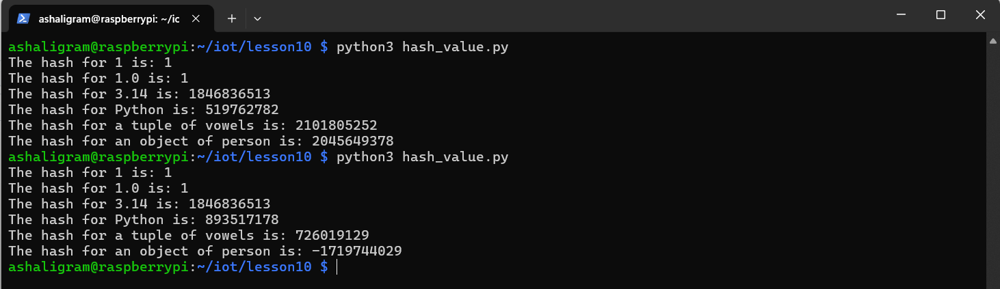

## SHA-2 Secure Hash Algorithm

## cat snakecoin.py
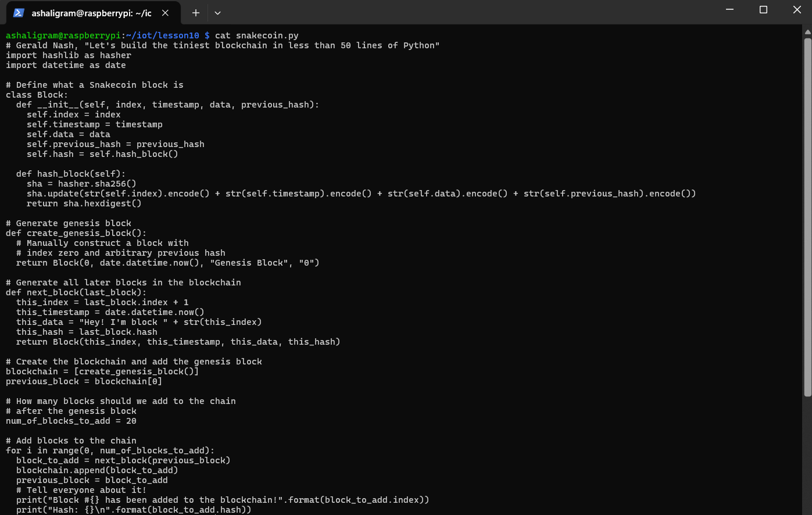

## python3 snakecoin.py
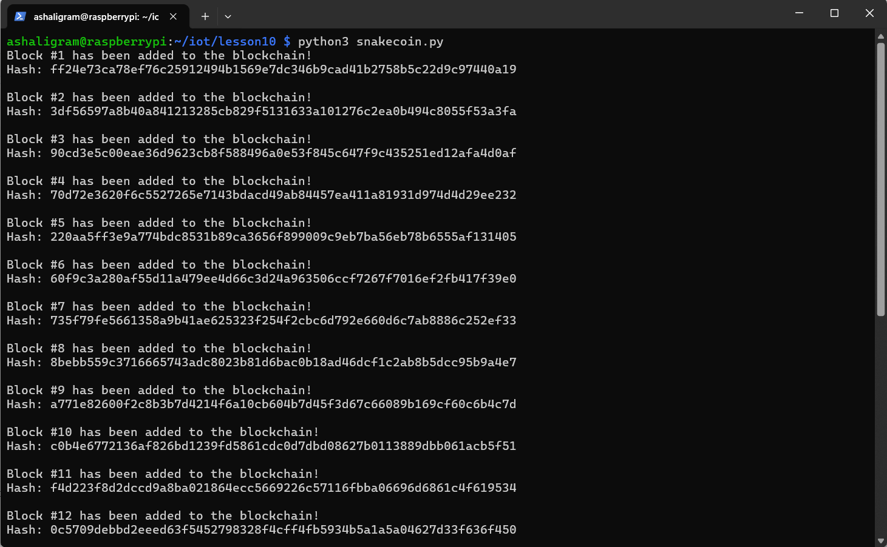

## cat snakecoin-server-full-code.py
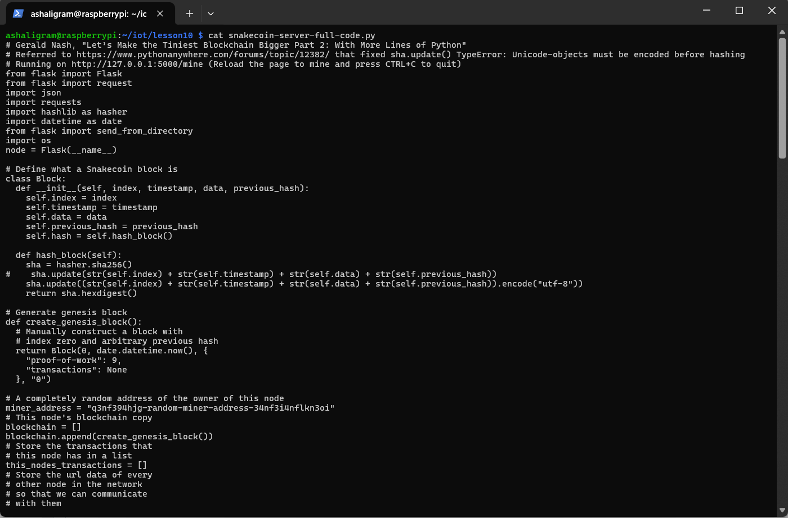
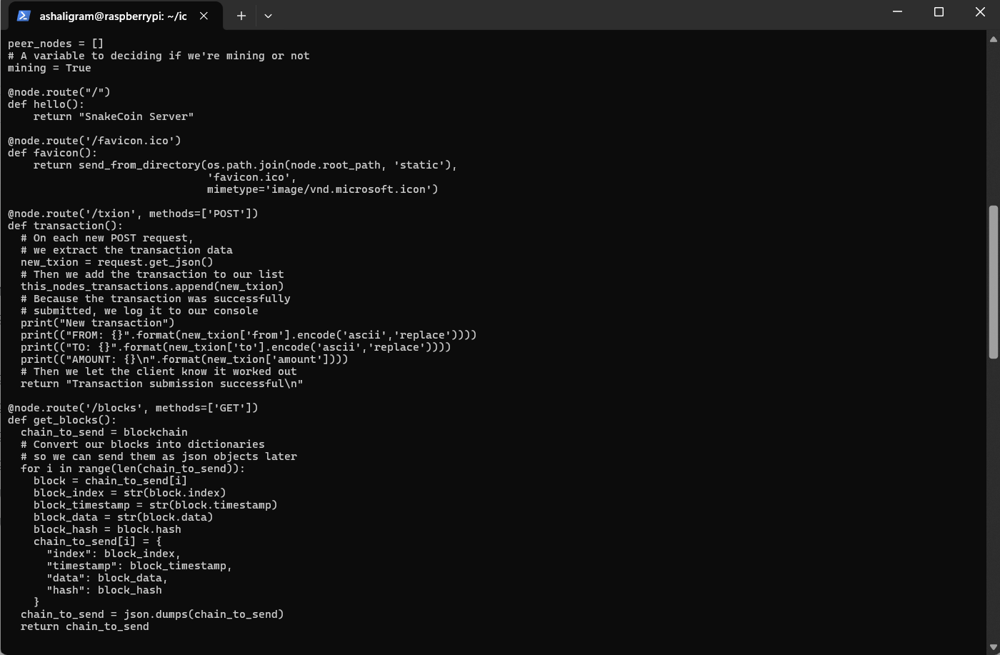
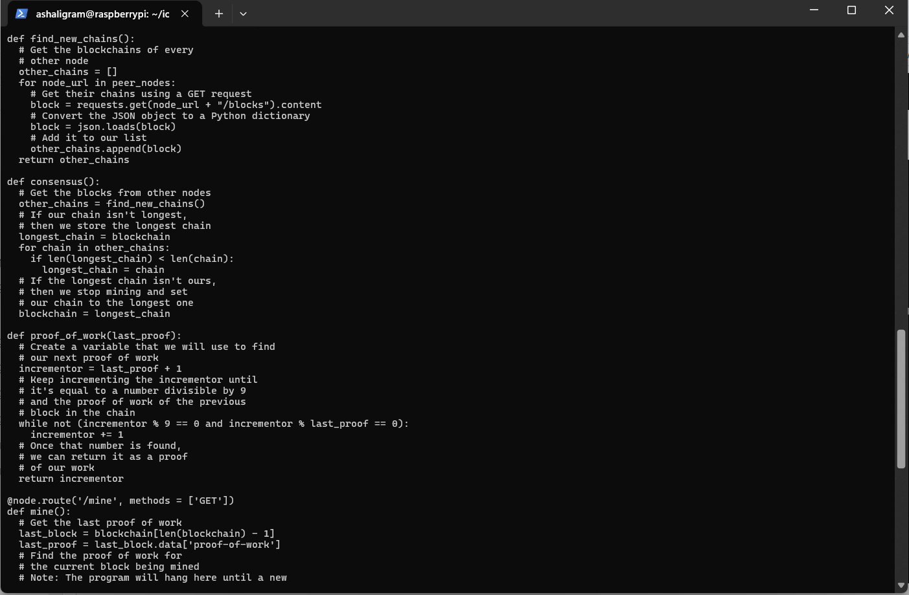
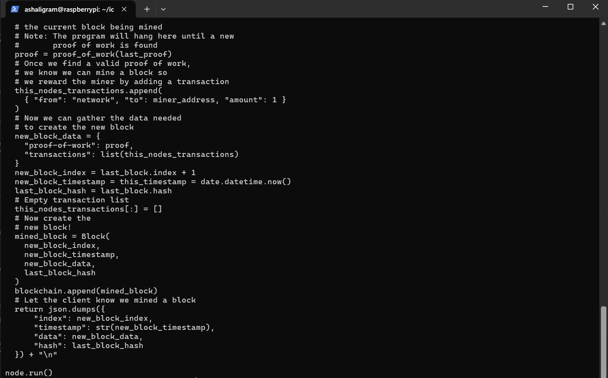

## SnakeCoin Server
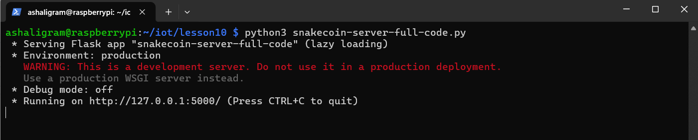
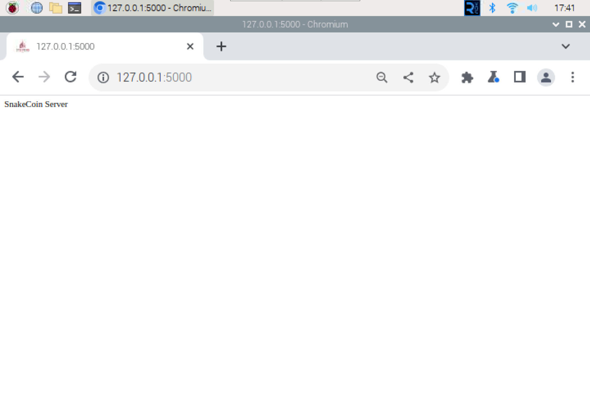

## SnakeCoin Server Mine
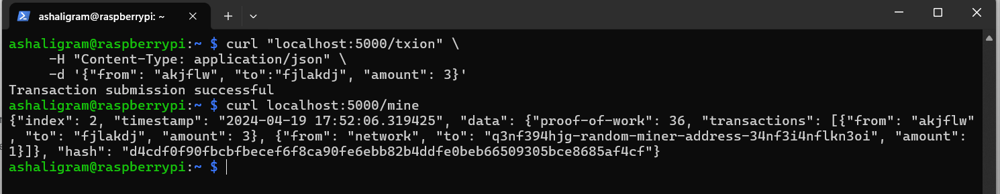
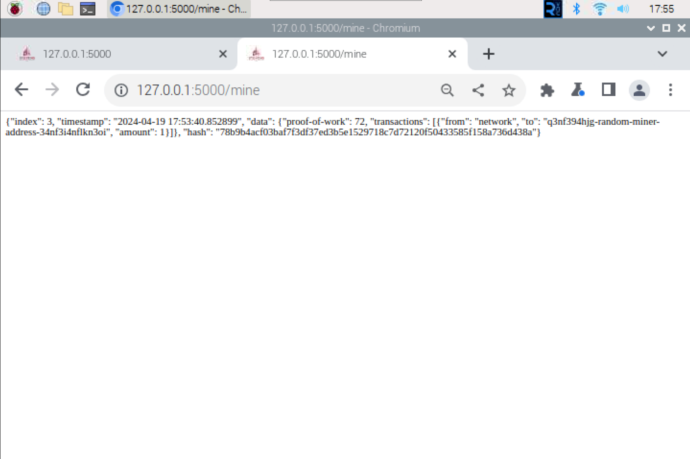

## Python Blockchain App
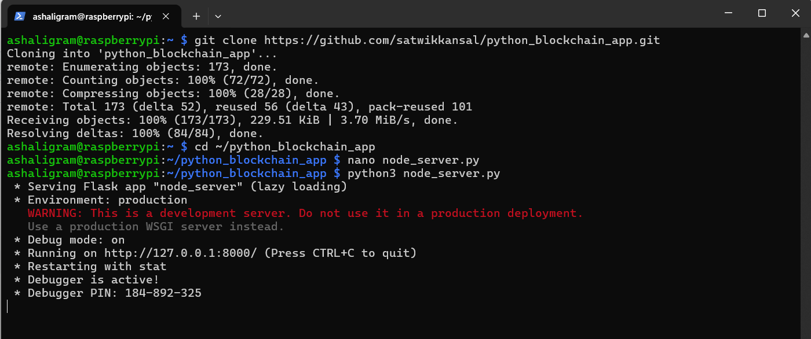
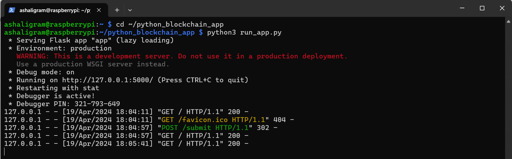
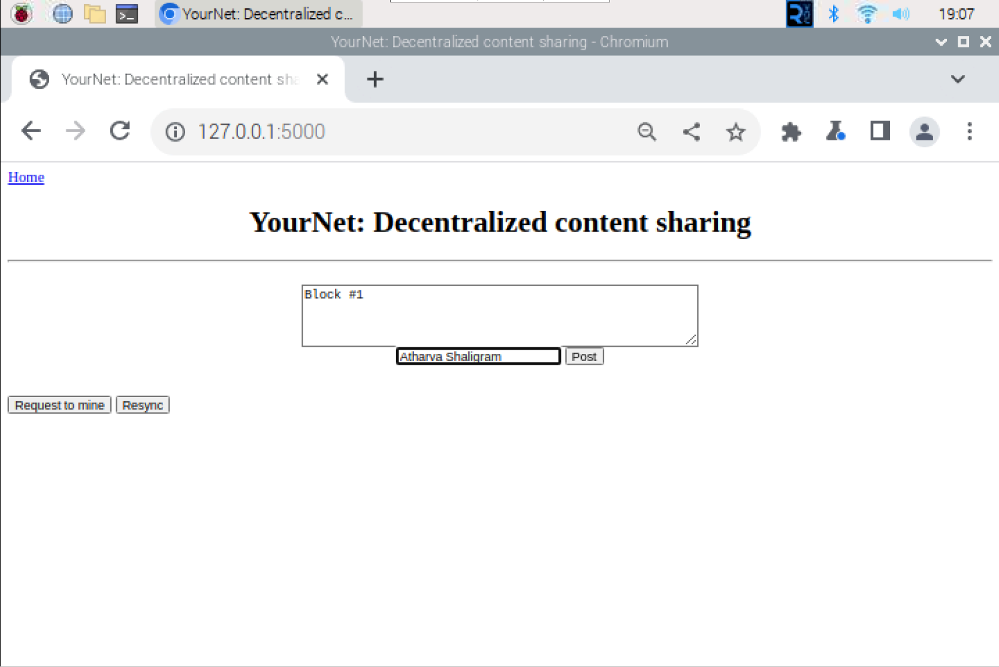
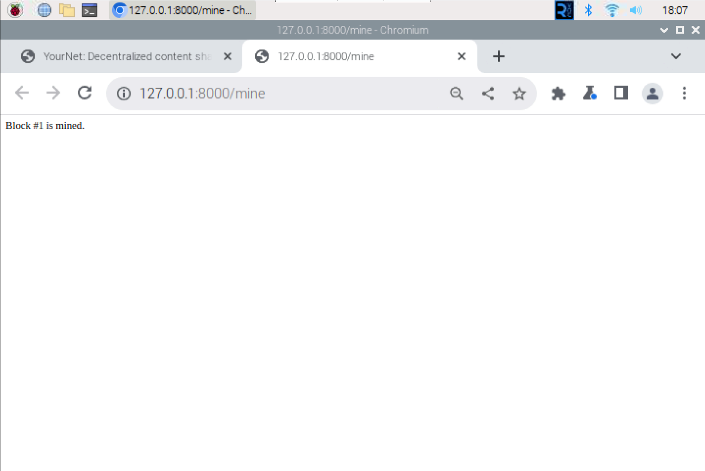

## Python Blockchain App Block
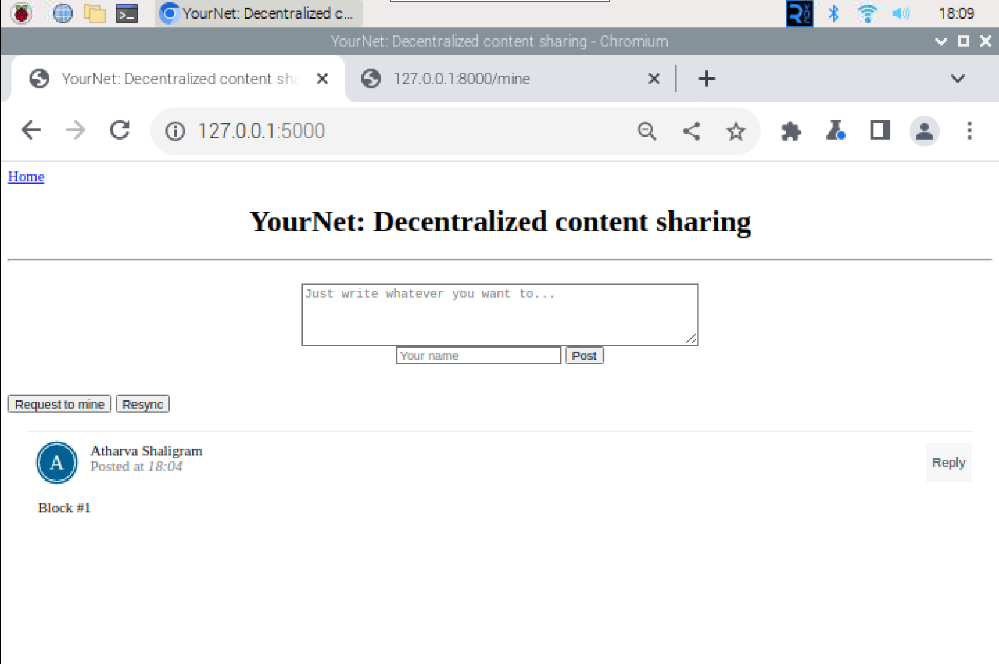
