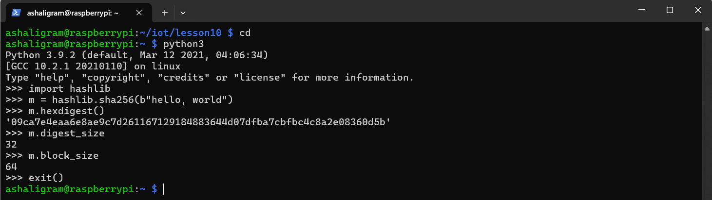

# CPE322: Lab 10 - Blockchain

## hash_value.py

## SHA-2 Secure Hash Algorithm

## cat snakecoin.py

## python3 snakecoin.py

## cat snakecoin-server-full-code.py

## SnakeCoin Server

## SnakeCoin Server Mine

## Python Blockchain App

## Python Blockchain App Block

