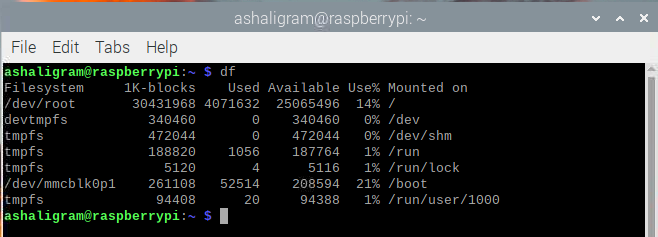
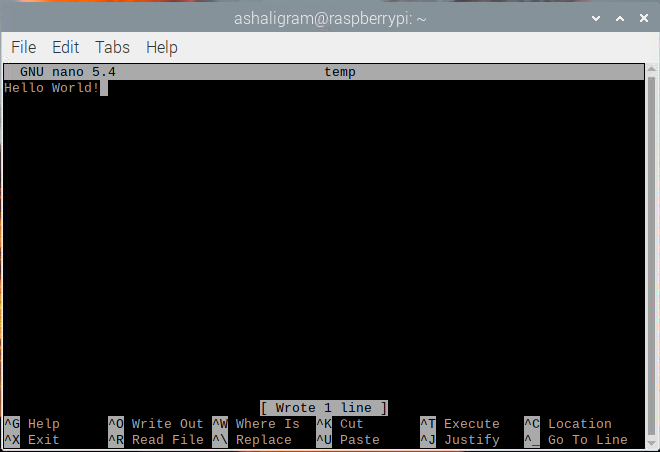
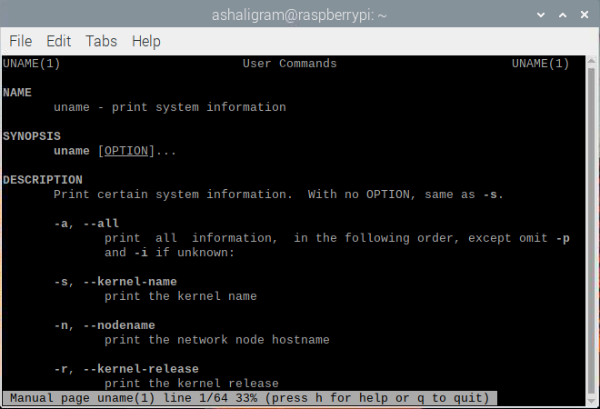
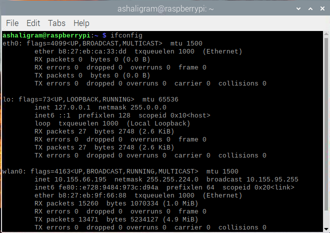
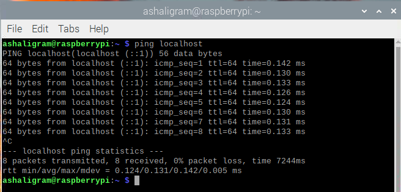

# Lab 2

## hostname

## env
***This command displays current environment and shows a list of environment variables***

## ps

## pwd

## git clone

## cd iot/ls

## cd ..

***This command goes back to the previous directory***

## df

## mkdir demo/cd demo

## nano file

## cat file

## cp file file1

## mv file file2/rm file2

## clear

***This command clears the entire terminal***

## man uname

## uname -a

## ifconfig

## ping localhost

## netstat

***This command shows the network status and can determine amount of traffic on network, shows a list of TCP connections***
