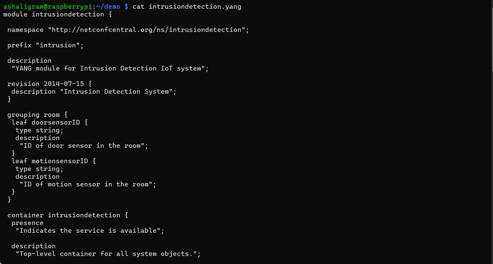
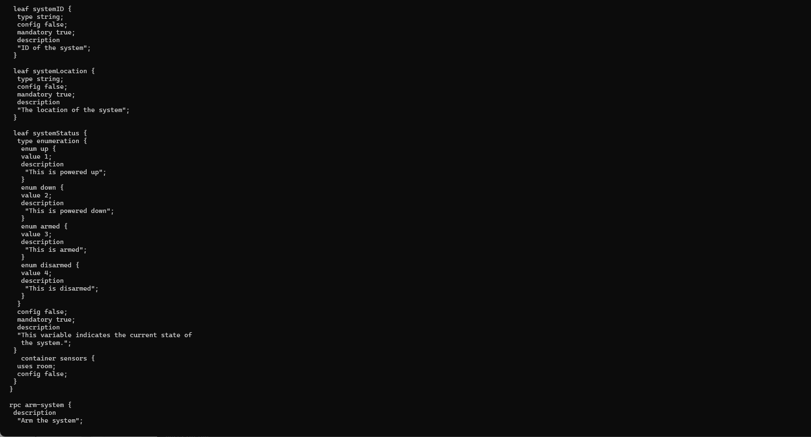
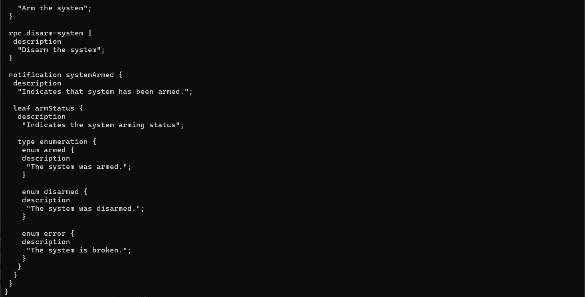
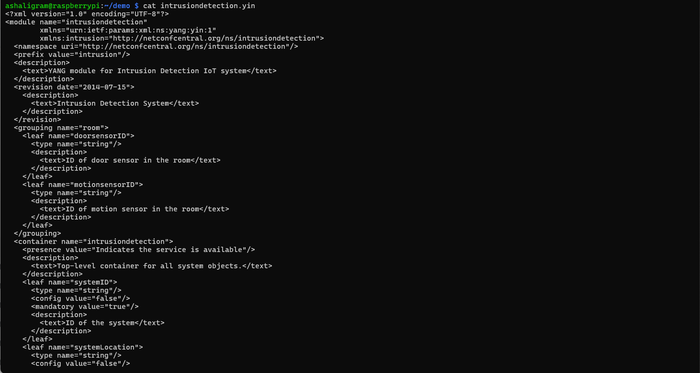
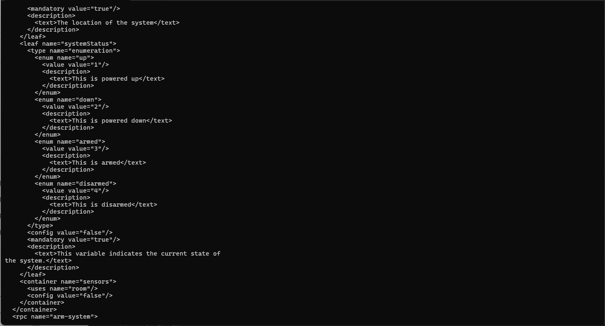
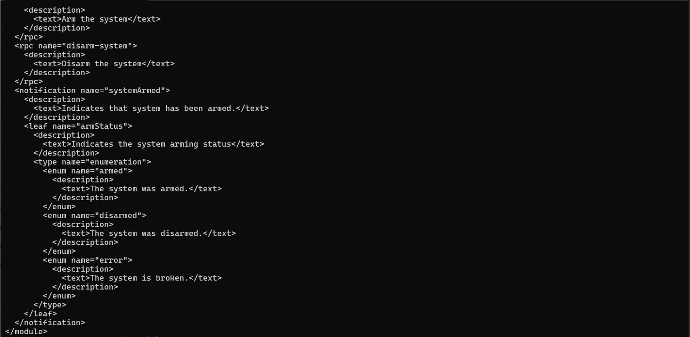
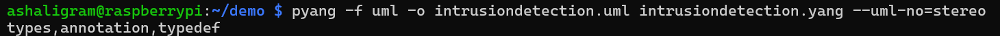
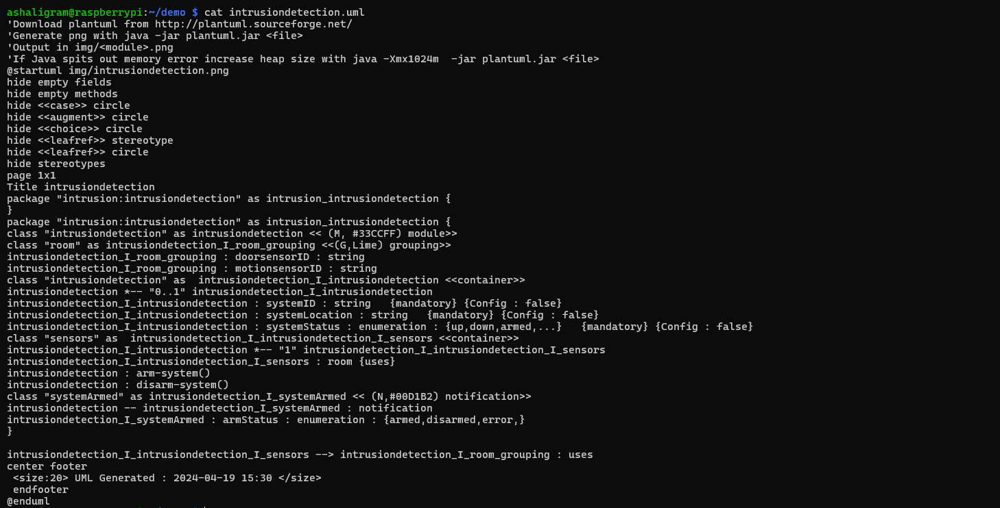
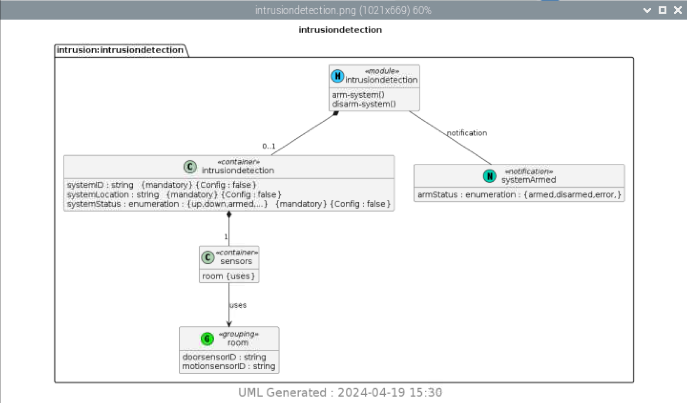

# CPE322: Lab 9 - YANG

## cat intrusiondetection.yang

## pyang -f yin -o intrusiondetection.yin intrusiondetection.yang

## cat intrusiondetection.yin

## pyang -f uml -o intrusiondetection.uml

## cat intrusiondetection.uml

## python3 -m plantuml intrusiondetection.uml

## Intrusion Detection Image

